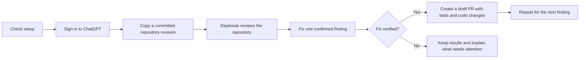

# Daybreak Launcher

Review a repository with Daybreak Blue, generate fixes, and create one draft GitHub pull request or GitLab merge request per verified finding. The launcher uses the official Codex Security CLI; it does not require the earlier browser workbench.

**Experimental preview.** [Download the launcher ZIP](https://github.com/redxking/daybreak-launcher/releases/download/v0.1.0-preview.2/Daybreak-Launcher.zip) or read the [release notes](https://github.com/redxking/daybreak-launcher/releases/tag/v0.1.0-preview.2). This is an independent launcher, not an official OpenAI product.

**Public repository disclosure:** the default workflow pushes fix branches and opens draft requests automatically. On a public repository, those changes and vulnerability explanations are public before a fix is merged. Use `--scan-only` when findings need private review or coordinated disclosure first. Draft status does not make a request private.



## Start

Extract the entire ZIP before opening a launcher. Have a Daybreak-enabled ChatGPT account and a GitHub/GitLab account with permission to push branches to the repository.

| Computer | Open |
|---|---|
| Windows | `Start Daybreak.cmd` |
| macOS | `Start Daybreak.command` |
| Linux | Run `sh "Start Daybreak.sh"` in the extracted folder |
| Remote/cloud development machine | Run the Python script in its terminal with `--device-auth` |

Enter a local code folder (including an extracted ZIP), a Git checkout, or a GitHub.com/GitLab.com repository URL. The default run performs analysis, fixes, and draft requests automatically. It never merges them. Local sessions use browser sign-in when needed. SSH sessions and Linux sessions without a display automatically use ChatGPT device sign-in: open the displayed verification link on another computer or phone and enter the code. No localhost callback is needed. Use `--device-auth` (or `--headless`) to force this flow, or `--browser-auth` to force the local browser flow. An existing valid ChatGPT session is reused.

Device sign-in still requires a person to authenticate; it is not unattended CI authentication. GitHub/GitLab sign-in is separate and follows the host CLI's instructions. If the CLI reports that device authentication is disabled for the account or workspace, enable it through the applicable account/admin settings or use local browser sign-in. The launcher does not change account policy.

**First-run prerequisites:** Python 3.11+, Node.js 24 with npm, and Git. The official engine also supports Node 22.13+ within 22.x and Node 26. For requests, install `gh` (GitHub CLI) or `glab` (GitLab CLI). Missing tools produce an installation link and a rerun instruction. The launcher automatically installs its pinned official Codex Security package in the user's profile; it does not silently install system tools or request administrator access.

- Windows: `winget install --exact --id Python.Python.3.13`; install [Node.js](https://nodejs.org/en/download), [Git](https://git-scm.com/downloads), and [GitHub CLI](https://cli.github.com/) or [GitLab CLI](https://gitlab.com/gitlab-org/cli#installation). Reopen the terminal afterward.
- macOS with Homebrew: `brew install python@3.13 node@24 git gh`. Node's installer is an alternative if `node@24` is not on PATH.
- Linux: install Python 3.11+ and Git through your distribution, then a supported Node release and the appropriate host CLI. Distribution Node versions can be too old; the launcher checks the actual version.

For example:

```sh
python3 daybreak.py https://github.com/OWNER/REPOSITORY
python3 daybreak.py "/path/to/local/repository"
python3 daybreak.py --check
python3 daybreak.py "/path/to/repository" --dry-run
python3 daybreak.py https://github.com/OWNER/REPOSITORY --scan-only
python3 daybreak.py https://github.com/OWNER/REPOSITORY --deep --device-auth
```

On Windows, substitute `py -3` for `python3`. iPhone/iPad cannot run this local launcher; use a supported remote development machine instead.

## What it checks and changes

- Detects desktop apps in common installation locations and lists installed/enabled Codex plugins when the CLI can report them. Detection is advisory; a portable/custom app location may be missed. Neither the desktop app nor separate Security plugin installation is required because the official CLI bundles that plugin.
- Uses a separate launcher profile and fresh ChatGPT sign-in when needed. It copies user configuration, rules, and legacy managed-policy files without copying login tokens. It preserves the forced workspace setting and rejects a configuration requiring API login or overriding the OpenAI provider. It sets `forced_login_method="chatgpt"`, strips API-key environment variables, checks ChatGPT login status, and explicitly selects ChatGPT authentication and Daybreak Blue. It does not purchase credits, reset usage, or fall back to API authentication. Subscription limits and model entitlement still apply.
- Reads each user's actual plugin state; it does not assume everyone has the same setup. Account training and retention controls are **not exposed by this CLI**. Review those in the user's account/workspace settings. The launcher does not claim to verify or change them.
- For Git repositories, clones a committed revision into a separate review directory. Local repositories must be clean, on a named branch. For PRs, that revision must already match the remote branch. Commit/push intended changes first. Submodules are initialized; Git LFS binary assets are excluded. This is a source review, not an all-assets inspection.
- Checks repository authentication and Git author identity. GitHub archived/read-only repositories stop before scanning in PR mode. GitLab authorization failures are reported by the host/Git commands; there is no claim that push permission was prevalidated. GitHub setup may configure its Git credential helper.
- Runs the official repository analysis, then patches confirmed findings individually with the same Daybreak model. Every patch gets a separate branch from the reviewed commit and an explicit target branch. Only a result reported as verified, with verification evidence and a consistent changed-file list, proceeds to a draft request. Failed fixes or unexpected changes stop the run and retain the checkout.
- Draft requests include the problem, affected locations, remediation, reported verification, and suggested tests. The host's Files changed view shows the exact original and replacement code. The launcher labels model-reported verification; it does not independently prove test assertions or certify application security.

The official combined `scan --patch --create-pr` command creates one PR per scan. This launcher separates patch and publication calls to meet the one-PR-per-finding requirement. Draft bodies and Git commits use the authenticated developer's configured identity; the guide's author is Angelis Pseftis.

## Local folders without Git

An extracted release ZIP is supported directly; you do not need to run `git init` in it. The launcher copies regular files to a review directory and creates a Git snapshot only inside that copy. Common credential files, Git metadata, symbolic links, and dependency caches are excluded. `source-snapshot.json` lists every included file with its SHA-256 hash and every excluded entry. This is a filename-based exclusion list, not a comprehensive secret detector.

The model reviews the copy and generates verified fixes on separate local branches. Each fix is saved as a `fix-occ_*.patch` file, with verification output and `local-fixes.json`. Your original folder is not edited and no remote request is created. Inspect the patch, then apply the chosen change from the original folder with `git apply /path/to/fix-occ_ID.patch`. Check first with `git apply --check /path/to/fix-occ_ID.patch`. Separate patches can overlap; rerun tests after applying them. A clean Git checkout with no origin also keeps fixes locally.

For example:

```sh
python3 daybreak.py --deep "/path/to/Daybreak Launcher"
```

## Results and limitations

The CLI displays API-equivalent cost estimates even with ChatGPT authentication. Those figures are not billing receipts or measurements of remaining subscription allowance. Token activity indicates model work; a scan still needs its final report and coverage results before completion can be claimed.

Results stay under `DaybreakLauncher` in `%LOCALAPPDATA%` (Windows), `~/Library/Application Support` (macOS), or `$XDG_DATA_HOME` / `~/.local/share` (Linux). Each run prints its folder. Read the official `report.md`, findings, coverage, patch JSON files, and `requests.json`. A zero finding count does not establish security. Test recommendations are distinct from executed test evidence.

Scans may execute repository code with the user's OS permissions. An isolated checkout protects working files from ordinary patch edits; **it is not a security sandbox**. Run untrusted projects in an appropriately isolated development environment without unrelated credentials. The launcher filters model API-key variables, not every possible secret, and host credentials are needed for publication.

No Jira integration is required to create code-host requests. Self-hosted GitHub/GitLab, uncommitted-code snapshots, unattended token-based CI, and mobile local execution are outside this small launcher's current scope. A browser/device sign-in may be required on cloud machines. One failed finding stops subsequent publication to preserve its evidence; earlier created requests remain open. Resolve the reported failure before rerunning, since a new full run can create new requests.

The CLI is pinned to **0.1.27**. Update that pin only after checking authentication and output contracts. The retained browser workbench remains a separate prototype.

## Verification

On macOS, 19 unit/integration tests and four native CLI smoke checks passed. Windows/Linux branches require native qualification before broad distribution. A dry run checks preparation, not model entitlement, scan quality, vulnerability reproduction, or actual PR publication. See the accompanying `test-results.txt` for the completed checks and their boundaries.

To repeat the tests from the extracted folder:

```sh
python3 -m unittest test_launcher.py -v
python3 verify_native.py
```

The native smoke script may install the pinned CLI. It checks authentication refusal and preflight, then generates explicitly synthetic output to test the publication rejection. It performs no model analysis or external publication.

## Official references

- [CLI setup, sign-in, scans and patches](https://learn.chatgpt.com/docs/security/cli)
- [Security plugin and desktop workbench](https://learn.chatgpt.com/docs/security/plugin)
- [CLI FAQ](https://learn.chatgpt.com/docs/security/cli/faq)
- [Configuration reference](https://learn.chatgpt.com/docs/config-file/config-reference)
- [Managed configuration](https://learn.chatgpt.com/docs/enterprise/managed-configuration)
- [Official Codex Security source](https://github.com/openai/codex-security)
